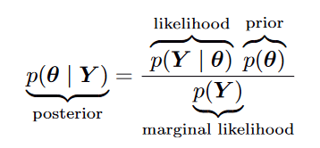
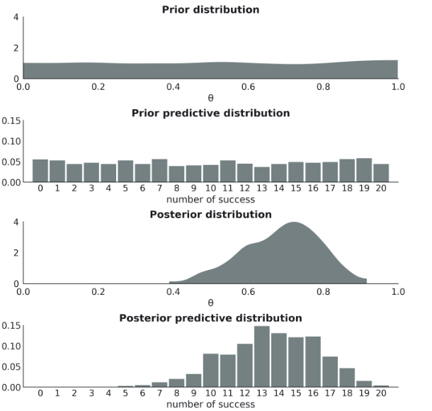
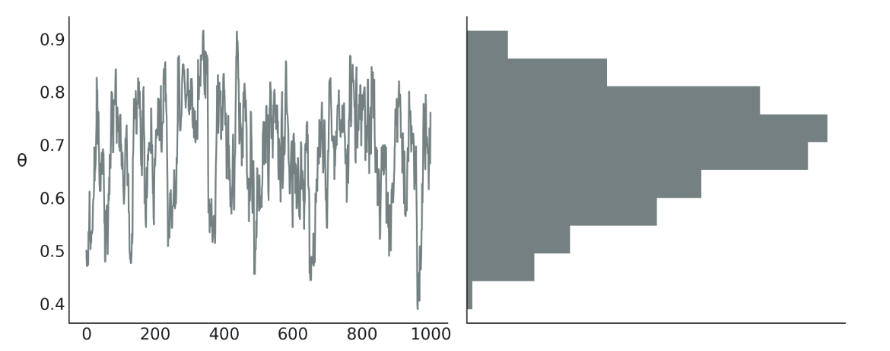

# GSoc ArviZ Dashboard Blog (6.16-6.24)

In this blog, we will cover the major learning points from chapter 1 & chapter 2 of the book [Bayesian Modeling and Computation in Python](https://bayesiancomputationbook.com/welcome.html) to justify why we are trying to build dashboard for **model comparison** and for future reference

## Terminologies

First, we should learn certain group of terms which helps us better understand the Bayesian models and related visualizations

### Bayesian Related
- Bayesian Inference 
Bayesian inference is a particular form of statistical inference based on combining probability distributions in order to obtain other probability distributions. 
  
The likelihood function links the observed data with the unknown parameters while the prior distribution represents the uncertainty about the parameters before observing the data Y . By multiplying them we obtain the posterior distribution, that is the joint distribution over all the parameters in the model (conditioned on the observed data).
    - Prior
    - Posterior
        - posterior is (always) a distribution
    - Lielihood
    - Marginal likelihood
- prior predictive distribution (observation)
    - prior predictive distribution is not conditioning on the observed data
    - prior predictive distribution is a probability distribution.
    - often combined with domain knowledge to evaluate the model
- posterior predictive distribution (observation)
    - this is the data the model is expecting to see after seeing the dataset Y
  

- Bayesian Models
    - Unknown quantities are described using probability distributions.
    - Bayes’ theorem is used to update the values of the parameters conditioned on the data.
- Universal Inference Engines
    - Markov chain Monte Carlo methods (MCMC): also known as samplers, approximate the posterior distribution by samples
      
    - Proposal Distribution: The samples from the posterior distribution are generated by accepting or rejecting samples from a different distribution called the proposal distribution
- **[Important]** Bayesian Workflow
    - Given some data and some assumptions on how this data could have been generated, we design a model by combining and transforming random variables. 
    - We use Bayes’ theorem to condition our models to the available data. We call this process inference, and as a result we obtain a posterior distribution. We hope the data reduces the uncertainty for possible parameter values, though this is not a guaranteed of any Bayesian model
    - We criticize the model by checking whether the model makes sense according to different criteria, including the data and our expertise on the domain-knowledge. Because we generally are uncertain about the models themselves, we sometimes compare several models.
- Exploratory Analysis of Bayesian Models
    - Diagnosing the quality of the inference results obtained using numerical methods
    - Model criticism, including evaluations of both model assumptions and model predictions.
    - Comparison of models, including model selection or model averaging. 
    - Preparation of the results for a particular audience.
- prior predictive checks
- posterior predictive checks

### Python Package
- PyMC3
- TensorFlow Probability (TFP)
- ArviZ

## Claims

In chapter 1 & 2, there are also some points we probably can use for future work. e.g, writing
- Building a model requires a combination of domain expertise and statistical skill
- Statistical distributions are the main mathematical tools to shape the statistical model
- our results are conditioned not only on the data but also on the models